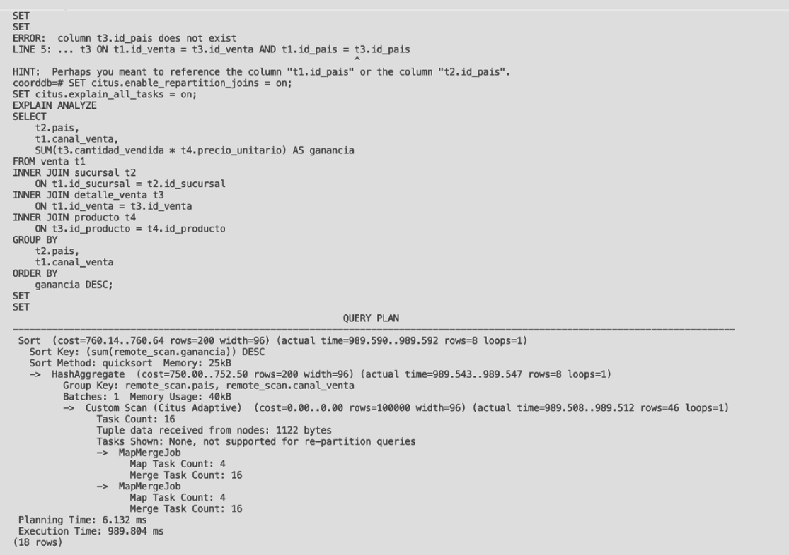
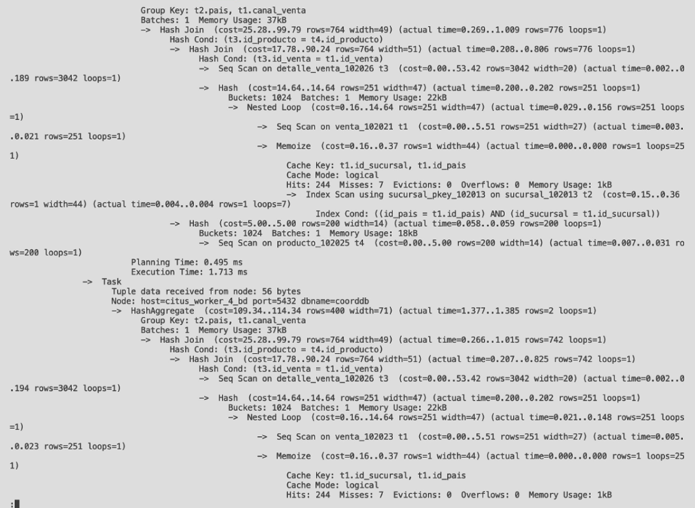
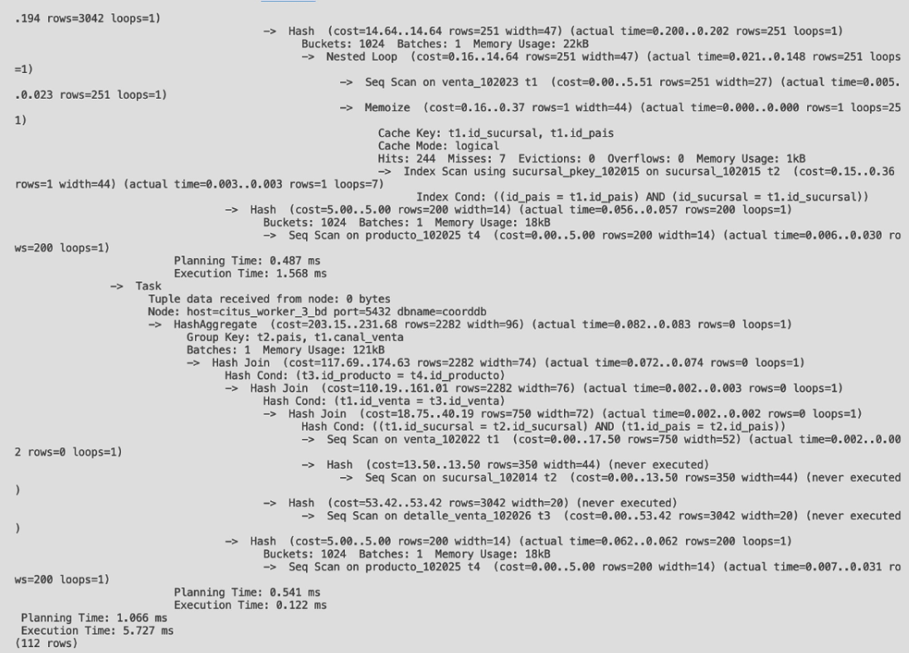

# 🌐 Distributed Sharding Showcase

## 📉 Scenario: Scaling Multi-Country Operations
**The Problem:** The centralized database was becoming a bottleneck for write operations. Additionally, reporting queries for a specific country were scanning the entire global dataset, causing unnecessary I/O.

**The Solution:** We implemented a **Shared-Nothing Architecture** using Citus, partitioning data by Country to ensure geographic isolation and scalability.

---

### 1. Infrastructure as Code (Docker Compose)
We provisioned a 5-node cluster: 1 Coordinator and 4 Workers.

```yaml
version: '3'
services:
  # --- COORDINATOR NODE ---
  citus_coordinator:
    image: citusdata/citus:12.1
    container_name: citus_coordinator
    ports: ["5437:5432"]
    environment:
      POSTGRES_USER: postgres
      POSTGRES_PASSWORD: 0000 
      POSTGRES_DB: coorddb
    networks: [citusnet]

  # --- WORKER NODES (1 to 4) ---
  citus_worker_1:
    image: citusdata/citus:12.1
    environment: {POSTGRES_PASSWORD: 0000}
    networks: [citusnet]
  
  # ... (Workers 2, 3, and 4 follow the same configuration)

networks:
  citusnet:
```
### 2. The Distribution Strategy
To ensure that all data related to a specific store stays together, we modified the primary keys to include the Country ID.

Shard Key: id_pais (Country ID).

Goal: Co-location. All sales, details, and products for "Mexico" must live on the same node.

```sql
-- 1. Modify Primary Keys to include the Distribution Column
ALTER TABLE sucursal DROP CONSTRAINT sucursal_pkey;
ALTER TABLE sucursal ADD CONSTRAINT sucursal_pkey PRIMARY KEY (id_pais, id_sucursal);

-- 2. Distribute the Tables (Co-location)
-- We distribute 'sucursal' by 'id_pais'.
SELECT create_distributed_table('sucursal', 'id_pais');

-- We enforce that other tables are co-located with 'sucursal'
SELECT create_distributed_table('venta', 'id_pais', colocate_with => 'sucursal');
SELECT create_distributed_table('detalle_venta', 'id_pais', colocate_with => 'sucursal');

-- 3. Reference Tables
-- Small tables like 'metodo_pago' are replicated to ALL nodes for fast local joins.
SELECT create_reference_table('metodo_pago');
```

### 3. Performance Analysis: Co-located vs. Repartition Join
We executed a complex query calculating Profit by Country and Channel to test the architecture.

✅ Scenario A: Co-located Join (The Optimized Way)
All tables were joined on the distribution key (id_pais).

```sql
-- Query executed with co-location logic
SELECT t2.pais, t1.canal_venta, SUM(...) 
FROM venta t1
INNER JOIN sucursal t2 ON t1.id_sucursal = t2.id_sucursal AND t1.id_pais = t2.id_pais
...
```
EXPLAIN ANALYZED





**Results:**

- Network Traffic: Only 212 bytes transferred.
- Execution Strategy: The coordinator pushed the query down to each worker. Each worker processed its own country data locally and sent back only the final 4 rows.
- Conclusion: This demonstrates the power of sharding. The cluster processes in parallel with zero cross-node data movement.

⚠️ Scenario B: Repartition Join (The Unoptimized Way)
We forced a join without using the distribution key, simulating a poorly designed query.
```sql
-- Query forced to repartition
SET citus.enable_repartition_joins = on;
SELECT ... FROM venta t1 INNER JOIN sucursal t2 ON t1.id_sucursal = t2.id_sucursal;
```
EXPLAIN ANALYZED 


**Results:**

- Execution Time: 989.8 ms (vs ~2ms per worker in Scenario A).
- Data Movement: Massive. Workers had to shuffle data across the network to find matching rows on other nodes.
- Conclusion: The Repartition Join is drastically slower because it is dominated by network latency and bandwidth bottlenecks. It breaks the principle of data locality.
