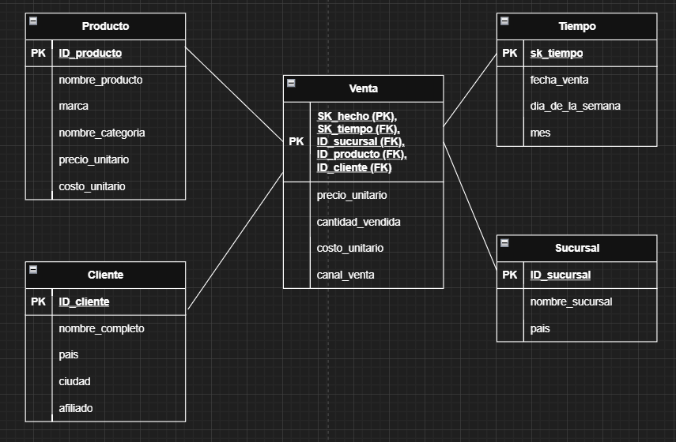

### 1. Dimensional Modeling (OLTP to OLAP)
We transitioned from a highly normalized model (3NF) optimized for transactions to a denormalized **Star Schema** optimized for reading.

#### 🔴 The Source: Relational Model (OLTP)
The initial system required joining 6+ tables to get a single sales report, causing performance bottlenecks.

#### 🟢 The Target: Star Schema (OLAP)
We redesigned the schema into a Fact Table surrounded by descriptive Dimensions. This simplifies queries and improves aggregation speed.

* **Fact Table:** `Fact_Ventas` (Contains metrics: Quantity, Price, Cost, Margin).
* **Dimensions:** `Dim_Tiempo`, `Dim_Producto`, `Dim_Sucursal`, `Dim_Cliente`.

### 2. The ETL Pipeline (Pentaho / Spoon)
We orchestrated a robust ETL process to populate the Data Mart. Below is the breakdown of the logic applied to each dimension and fact table.

#### 🏗️ Dimension Transformations
* **Dim_Tiempo (Time):** Extracted dates from the source. Generated a sequential Surrogate Key (`sk_tiempo`) and derived new analytical attributes: `Day_of_Week` and `Month_Name` to enable seasonal analysis.
* **Dim_Cliente (Customer):** Extracted raw data and applied a concatenation transformation (`Nombre` + `Apellido`) to create a unified `Full_Name` field for reporting.
* **Dim_Producto (Product):**
    * **Join:** Integrated data from the `Category` table (originally normalized).
    * **Enrichment:** Calculated a synthetic `Unit_Cost` (estimated as 70% of the sales price) since cost data was missing in the source. This enables Gross Margin calculation.
* **Dim_Sucursal (Branch):** Direct mapping of Branch Name and Country.

#### 🚀 Fact Table Transformation (Fact_Ventas)
This was the most complex pipeline, integrating data from multiple streams.

**Workflow Logic:**
1.  **Source & Join:** Extracted Sales and joined with `Product` details.
2.  **Surrogate Keys:** Generated the `sk_hecho` (Primary Key).
3.  **Merge Join:** Sorted and merged the stream with `Dim_Tiempo` to retrieve the correct `sk_tiempo`.
4.  **Stream Lookup:** Used a lookup against the transformed `Dim_Producto` flow to retrieve the calculated `Unit_Cost` (Data Enrichment).
5.  **Load:** Final mapping and insertion into the PostgreSQL Data Mart.
