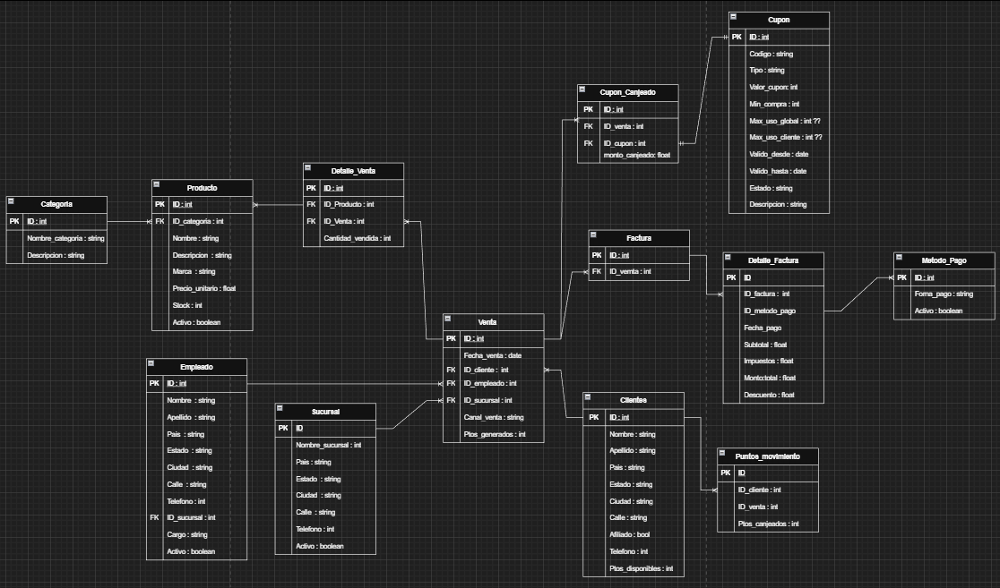
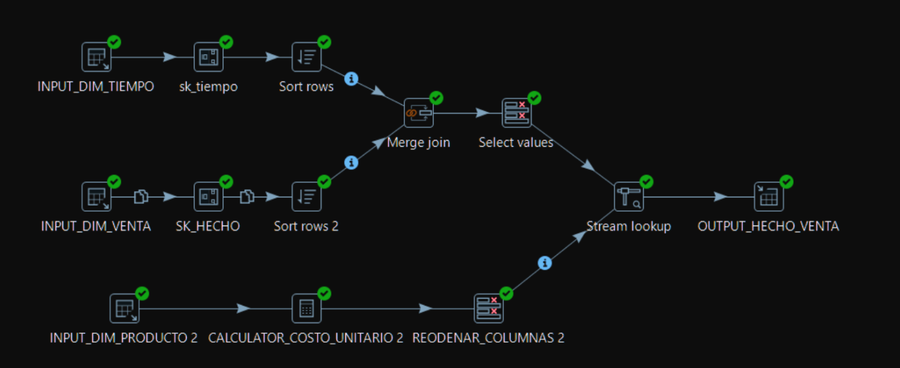
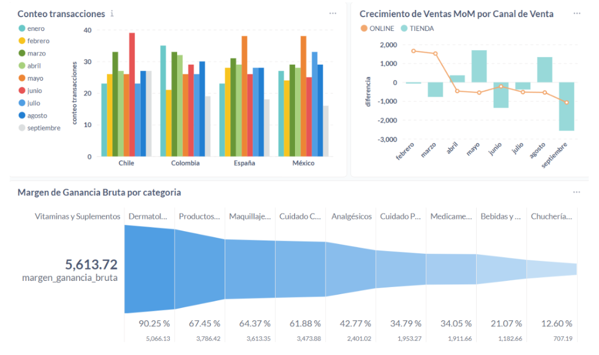

# 🏭 ETL & BI Showcase

## 📉 Scenario: From Data to Insights
**The Problem:** The operational database was optimized for transactions, making analytical queries (e.g., "Profitability by Product Category per Month") slow and complex to write. Business stakeholders needed a consolidated view of performance.

**The Solution:** We implemented a **Data Mart** using Dimensional Modeling and an automated ETL pipeline.

---

### 1. Dimensional Modeling (OLTP to OLAP)
We transitioned from a highly normalized model optimized for transactions to a denormalized **Star Schema** optimized for reading.

#### 🔴 The Source: Relational Model (OLTP)
The initial system required joining 6+ tables to get a single sales report, causing performance bottlenecks.

#### 🟢 The Target: Star Schema (OLAP)
We redesigned the schema into a Fact Table surrounded by descriptive Dimensions. This simplifies queries and improves aggregation speed.

* **Fact Table:** `Fact_Ventas` (Contains metrics: Quantity, Price, Cost, Margin).
* **Dimensions:** `Dim_Tiempo`, `Dim_Producto`, `Dim_Sucursal`, `Dim_Cliente`.

---

### 2. The ETL Pipeline (Pentaho / Spoon)
We orchestrated a robust ETL process to populate the Data Mart. Below is the breakdown of the logic applied to each dimension and fact table.

#### 🏗️ Dimension Transformations
* **Dim_Tiempo (Time):** Extracted dates from the source. Generated a sequential Surrogate Key (`sk_tiempo`) and derived new analytical attributes: `Day_of_Week` and `Month_Name` to enable seasonal analysis.
* **Dim_Cliente (Customer):** Extracted raw data and applied a concatenation transformation (`Nombre` + `Apellido`) to create a unified `Full_Name` field for reporting.
* **Dim_Producto (Product):**
    * **Join:** Integrated data from the `Category` table (originally normalized).
    * **Enrichment:** Calculated a synthetic `Unit_Cost` (estimated as 70% of the sales price) since cost data was missing in the source. This enables Gross Margin calculation.
* **Dim_Sucursal (Branch):** Direct mapping of Branch Name and Country.

#### 🚀 Fact Table Transformation (Fact_Ventas)
This was the most complex pipeline, integrating data from multiple streams.

**Workflow Logic:**
1.  **Source & Join:** Extracted Sales and joined with `Product` details.
2.  **Surrogate Keys:** Generated the `sk_hecho` (Primary Key).
3.  **Merge Join:** Sorted and merged the stream with `Dim_Tiempo` to retrieve the correct `sk_tiempo`.
4.  **Stream Lookup:** Used a lookup against the transformed `Dim_Producto` flow to retrieve the calculated `Unit_Cost` (Data Enrichment).
5.  **Load:** Final mapping and insertion into the PostgreSQL Data Mart.

---

---

### 3. Business Intelligence Dashboard
The final output was a comprehensive dashboard in **Metabase**, designed to answer specific strategic questions regarding Customer Behavior, Profitability, and Channel Performance.

#### 📊 Deep-Dive Analysis & Strategic Insights

We didn't just visualize data; we uncovered actionable patterns to drive business growth.

**1. Customer Purchasing Habits (Ticket Analysis)**
* **Visual:** "Ticket Average by Day of Week" (Scatter Plot).
* **Observation:** There is a consistent downward trend in average spending from **Thursday ($108)** to **Monday ($84)**.
* **Strategic Insight:** Customers exhibit a "stock-up" behavior leading into the weekend. Mondays and Wednesdays are low-value transaction days.
* **Recommendation:** Launch "Earky-Week Booster" promotions (e.g., *Double Points on Mondays*) to flatten the revenue curve and incentivize traffic during low-performance days.

**2. Profitability Mix (Category Margins)**
* **Visual:** "Gross Margin by Category" (Area Chart).
* **Observation:** While "Snacks & Candy" drive volume, they contribute minimally to the bottom line. **"Vitamins & Supplements"** and **"Dermatological Products"** are the true profit drivers.
* **Strategic Insight:** The business relies heavily on high-margin health products.
* **Recommendation:** Optimize store layout to place high-margin Vitamins near the checkout line (traditionally reserved for low-margin candy) to increase the profitability of impulse buys.

**3. Channel Volatility (Online vs. Physical)**
* **Visual:** "MoM Sales Growth by Channel" (Combo Chart).
* **Observation:** The channels do not grow in sync. We observed months where Online sales spiked (+20%) while Physical store sales remained flat or declined.
* **Strategic Insight:** This suggests distinct customer segments or successful digital-only campaigns that do not cannibalize store traffic.
* **Recommendation:** Treat Online and Physical as separate P&Ls. Continue aggressive digital marketing as it captures incremental revenue rather than shifting existing customers.

**4. Loyalty Program Effectiveness**
* **Visual:** "Affiliated Customer Sales Rate" (KPI Card).
* **Observation:** **50.52%** of sales come from identified loyalty members.
* **Strategic Insight:** While the program is healthy, 50% of transactions remain anonymous, creating a "data blind spot."
* **Recommendation:** Implement a "Sign-up at Checkout" incentive (e.g., instant 5% discount) to capture data from the remaining half of the customer base.
